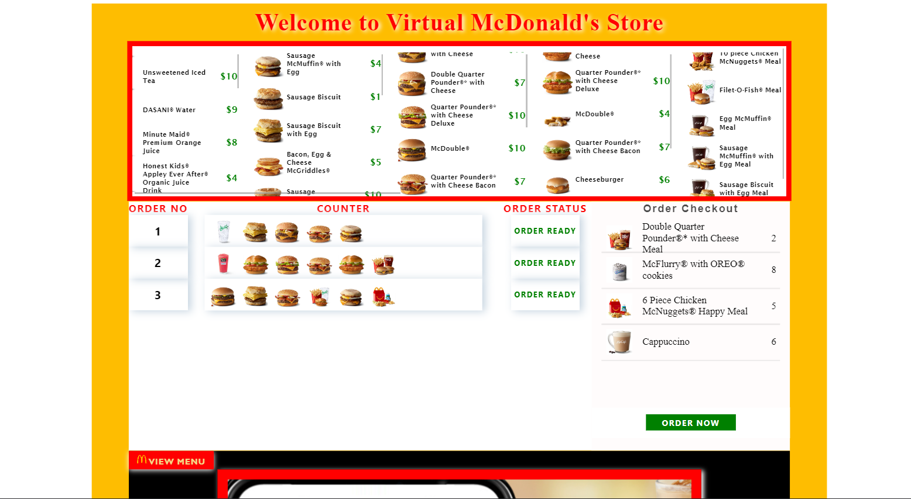

# Virtual McDonald's

This project had made as an assignment with the concept of McDonald Counter.
As, we all know JavaScript is a single threaded language.
So, the promise concept used here to develop multithreading in JS. 

**Server:** Local Storage

# Home page

## Tech Stacks Used

- JavaScript
- HTML
- CSS

   
   
   

 

## Demo

Click the below link for demo

https://virtual-mc-donald.netlify.app/
